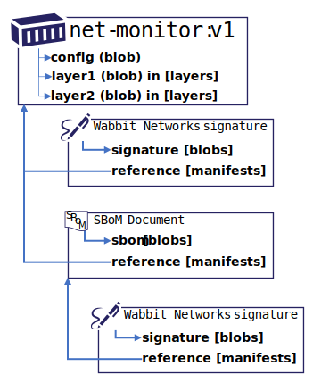

# OCI Artifact Manifest (Experimental)

The prototype-2 branch of ORAS implements [oci.artifact.manifest][oci-artifact-manifest], supporting references between artifact types. This capability enables a graph of objects to be established, including signatures, Software Bill of Materials (SBoMs) and other artifact types.



`oras` supports the [oci.artifact.manifest][oci-artifact-manifest-spec], enabling, persistence, discovery and retrieval of artifacts and artifact references.

This document covers:

- [Building the Experimental Branch](#building-the-experimental-branch)
- [Runing Distribution with OCI Artifact Manifest Support](#running-distribution-with-oci-artifact-manifest-support)
- [Pushing Artifact References](#pushing-artifact-references)
- [Discovering Artifact References](#discovering-artifact-references)
- [Discovering Artifacts with `artifactType` Filtering](#discovering-artifacts-with-artifactType-filtering)
- [Pulling Artifact References](#pulling-artifact-references)

## Building the Experimental Branch

- Build the `oci-artifact.manifest` experimental branch:
  ```bash
  git clone https://github.com/deislabs/oras.git
  cd oras
  git checkout prototype-2
  make build
  ```
- Copy `oras` to a central location for easy reference
  ```bash
  # linux, including wsl:
  sudo cp ./bin/linux/amd64/oras /usr/local/bin/oras
  ```
- Verify the version, noting the `+unreleased` version:
  ```bash
  oras version

  Version:        0.11.1+unreleased
  Go version:     go1.16.2
  Git commit:     6977a420ff804c49a401950502f5d98a9ed62812
  Git tree state: clean
  ```
- Verify the additional `discover` command, confirming the experimental branch
  ```bash
  oras --help
  Usage:
    oras [command]

  Available Commands:
    discover    discover artifacts from remote registry
    help        Help about any command
    login       Log in to a remote registry
    logout      Log out from a remote registry
    pull        Pull files from remote registry
    push        Push files to remote registry
    version     Show the oras version information
  ```

See the [developers guide](../BUILDING.md) for more details on building `oras`

## Running Distribution with OCI Artifact Manifest Support

Run a local instance of distribution, with `oci.artifact.manifest` support. The image is built from: [notaryproject/distribution/tree/prototype-2](https://github.com/notaryproject/distribution/tree/prototype-2)
> Note: this is a temporary location as oci.artifact.manifest is being developed under the [Notary v2][notary-v2-project] project.

```bash
docker run -it -p 5000:5000 --name oci-artifact-registry notaryv2/registry:nv2-prototype-2
```

## Pushing Artifact References

`oras push` will utilize the [oci.artifact.manifest][oci-artifact-manifest] when `--artifact-type` is specified. The OPTIONAL `--artifact-reference` accepts both tags and digests. Tag references are converted to digests when persisted.

For example, push a simulated Software Bill of Materials (SBoM) artifact `sbom.json` of `application/x.example.sbom.v0` type, linking to another artifact `localhost:5000/test:latest`:

- Push `hello-world:latest` to the locally instanced registry:
  ```bash
  docker pull hello-world:latest 
  docker tag hello-world:latest localhost:5000/hello-world:latest
  docker push localhost:5000/hello-world:latest
  ```
- Create a sample SBoM document:
  ```shell
  echo '{"version": "0.0.0.0", "image": "docker.io/hello-world:latest", "contents": "good"}' > sbom.json
  ```
- Push the SBoM, referencing the `hello-world:latest` image:
  ```shell
  oras push localhost:5000/hello-world \
      --artifact-type application/x.example.sbom.v0 \
      --artifact-reference localhost:5000/hello-world:latest \
      sbom.json:application/tar
  ```
- Generates output:
  ```shell
  Uploading 204e7c423c89 sbom.json
  Pushed localhost:5000/hello-world
  Digest: sha256:f4232599e2d5246ec1f4dc419bacd5510a02c2f0e3c98b800f38c8cbbd61550d
  ```

## Discovering Artifact References

To find the list of artifacts that reference a target artifact (such as a container image), the `oras discover` api provides a quick means to list all, or specific artifact references.

- Discover the artifacts which reference `localhost:5000/hello-world:latest`
  ```
  oras discover --output-json localhost:5000/hello-world:latest
  ```
- Generates output:
  ```json
  {
    "digest": "sha256:1b26826f602946860c279fce658f31050cff2c596583af237d971f4629b57792",
    "references": [
      {
        "digest": "sha256:fa31146981940964ced259bd2edd36c10277207e3be4d161bdb96e5e418fc2e0",
        "manifest": {
          "schemaVersion": 2,
          "mediaType": "application/vnd.oci.artifact.manifest.v1+json",
          "artifactType": "application/x.example.sbom.v0",
          "blobs": [
            {
              "mediaType": "application/tar",
              "digest": "sha256:204e7c423c891d0e4b057c4ecb068a53ffc991ef5a3bb47467f1b8088775dc48",
              "size": 84
            }
          ],
          "manifests": [
            {
              "mediaType": "application/vnd.docker.distribution.manifest.v2+json",
              "digest": "sha256:1b26826f602946860c279fce658f31050cff2c596583af237d971f4629b57792",
              "size": 525
            }
          ]
        }
      }
    ]
  }
  ```

## Discovering Artifacts with `artifactType` Filtering

- Create a sample signature document:
  ```shell
  echo '{"version": "0.0.0.0", "target": "docker.io/hello-world:latest", "signature": "pat-doe"}' > signature.json
  ```
- Push the signature, referencing the `hello-world:latest` image:
  ```shell
  oras push localhost:5000/hello-world \
      --artifact-type application/x.example.signature.v0 \
      --artifact-reference localhost:5000/hello-world:latest \
      signature.json:application/tar
  ```

- Discover the artifacts which reference `localhost:5000/hello-world:latest`, filtered by `application/x.example.signature.v0`
  ```
  oras discover \
    --output-json \
    --artifact-type application/x.example.signature.v0 \
    localhost:5000/hello-world:latest
  ```

- Generates output:
  ```json
  {
    "digest": "sha256:1b26826f602946860c279fce658f31050cff2c596583af237d971f4629b57792",
    "references": [
      {
        "digest": "sha256:c5fbdddecc83f1af8743983ce114452b856b77e92a5c7f4075c0110ea1e35e38",
        "manifest": {
          "schemaVersion": 2,
          "mediaType": "application/vnd.oci.artifact.manifest.v1+json",
          "artifactType": "application/x.example.signature.v0",
          "blobs": [
            {
              "mediaType": "application/tar",
              "digest": "sha256:01aafb7acd80d5d25c7619b2d7ddd4912434f58dec3e479b822197fd8a385552",
              "size": 91
            }
          ],
          "manifests": [
            {
              "mediaType": "application/vnd.docker.distribution.manifest.v2+json",
              "digest": "sha256:1b26826f602946860c279fce658f31050cff2c596583af237d971f4629b57792",
              "size": 525
            }
          ]
        }
      }
    ]
  }
  ```

> Note: see [issue #255](https://github.com/deislabs/oras/issues/255) for `default` and `--verbose` output options

## Pulling Artifact References

Pulling an artifact is the same as the regular `oras pull`. This example 

- Pull a signature artifact by embedding `oras discover`
  ```shell
  oras pull -a \
      localhost:5000/hello-world@$( \
        oras discover \
          --output-json \
          --artifact-type application/x.example.signature.v0 \
          localhost:5000/hello-world:latest | jq -r .links[0].digest)
  ```

- Generates output:
  ```
  Downloaded 01aafb7acd80 signature.json
  Pulled localhost:5000/hello-world@sha256:c5fbdddecc83f1af8743983ce114452b856b77e92a5c7f4075c0110ea1e35e38
  Digest: sha256:c5fbdddecc83f1af8743983ce114452b856b77e92a5c7f4075c0110ea1e35e38
  ```

For more information see the [oci.artifact.manifest][oci-artifact-manifest] overview for various scenarios and usage.

[oci-artifact-manifest-spec]:   https://github.com/SteveLasker/artifacts/blob/oci-artifact-manifest/artifact-manifest-spec.md
[oci-artifact-manifest]:        https://github.com/SteveLasker/artifacts/blob/oci-artifact-manifest/artifact-manifest.md
[notary-v2-project]:            https://github.com/notaryproject/notaryproject