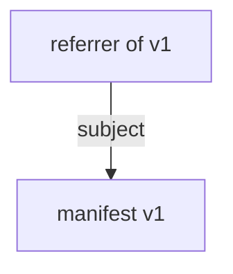

# oras check draft design

This is a draft design for the `oras check` command.

## UX

Command:

```
oras check [flags] <name>{:<tag>|@<digest>}

Example - validate a single image referenced by tag:
  oras check localhost:5000/hello:v1

Example - validate multiple images referenced by tags:
  oras check localhost:5000/hello:v1,v2,v3

Example - validate a single image referenced by digest:
  oras check localhost:5000/hello@sha256:fd6ed2f36b5465244d5dc86cb4e7df0ab8a9d24adc57825099f522fe009a22bb

```

Flags:

`--oci-layout` / `--oci-layout-path` ：OCI Layout validation

`--include-referrers`: include validation of the referrers (Note: this is predecessor validation, only enabled by flag)

`--concurrency`: set concurrency level

## Validation behaviors (For manifest only, not index yet)

**Step 1: Resolve the reference given by the user**

Returns an error if the reference fails to resolve, or resolves to a blob instead of a manifest.

**Step 2: Validate the manifest against the resolved descriptor**

Fetch the manifest content by descriptor, and check if the **MediaType**, **Size** and **Digest** are consistent with the descriptor.

**Step 3: Validate the blobs (config and layers) against the descriptors in the manifest**

Fetch the blobs (config and layers) by descriptors in the manifest, and check if the **Size** and **Digest** are consistent with the descriptors.




**Step 4: If the subject field is not empty, validate the subject manifest**

(Note: this is successor validation, enabled by default)

Do step 2 with the descriptor in the subject field. Then do step 3.

**Step 5: If --include-referrers flag is used, validate the referrers**

(Note: this is predecessor validation, only enabled by flag)

Resolve the referrer descriptors, then do step 2 and 3.

Verify that the subject descriptor of the referrers is consistent with the manifest.

## PoC implementation
https://github.com/oras-project/oras/pull/1801

## Questions for discussion
1. Should we support reference by digest?
2. Should we support validating index? What should the behavior be?
3. Should we support validating an entire repository? (`oras check localhost:5000/hello`, no image reference is given)