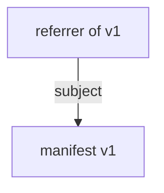

# oras check draft design

This is a draft design for the `oras check` command.

## UX

### Command:

```
oras check [flags] <name>{:<tag>|@<digest>}

Example - validate a single image referenced by tag:
  oras check localhost:5000/hello:v1

Example - validate multiple images referenced by tags:
  oras check localhost:5000/hello:v1,v2,v3

Example - validate a single image referenced by digest:
  oras check localhost:5000/hello@sha256:fd6ed2f36b5465244d5dc86cb4e7df0ab8a9d24adc57825099f522fe009a22bb
```

### Flags:

`--oci-layout` / `--oci-layout-path` ：OCI Layout validation

`--platform`: check specific platform for multi-arch image index

`--include-referrers`: include validation of the referrers (Note: this is predecessor validation, only enabled by flag)

`--concurrency`: set concurrency level

### Progress output:

The command should display progress output similar to the output of `oras cp`, showing the status of each component of the checked image. Both `tty` and `no-tty` modes should be supported.

```
oras check localhost:5000/hello:v1 --no-tty
Checking f18232174bc9 application/vnd.oci.image.layer.v1.tar+gzip
Checking aded1e1a5b37 application/vnd.oci.image.config.v1+json
Checked [succeeded] aded1e1a5b37 application/vnd.oci.image.config.v1+json
Checked [failed]    f18232174bc9 application/vnd.oci.image.layer.v1.tar+gzip
Checking 1c4eef651f65 application/vnd.oci.image.manifest.v1+json
Checked [succeeded] 1c4eef651f65 application/vnd.oci.image.manifest.v1+json
Checked [failed]    [registry] localhost:5000/hello:v1

Checked localhost:5000/hello:v1 in 15s. 1 check failed.
[Failed]
Error: oras check failed on f18232174bc9 application/vnd.oci.image.layer.v1.tar+gzip: layer size mismatch: expect 257, got 233
```

```
oras check localhost:5000/hello:v1
✓ Checked [failed]     application/vnd.oci.image.layer.v1.tar+gzip                                        3.47/3.47 MB 100.00%     2s
  └─ sha256:f18232174bc91741fdf3da96d85011092101a032a93a388b79e99e69c2d5c870
✓ Checked [succeeded]  application/vnd.oci.image.config.v1+json                                             581/581  B 100.00%  463ms
  └─ sha256:aded1e1a5b3705116fa0a92ba074a5e0b0031647d9c315983ccba2ee5428ec8b
✓ Checked [succeeded]  application/vnd.oci.image.manifest.v1+json                                         1022/1022  B 100.00%  437ms
  └─ sha256:1c4eef651f65e2f7daee7ee785882ac164b02b78fb74503052a26dc061c90474
Checked [failed]    [registry] localhost:5000/hello:v1

Checked localhost:5000/hello:v1 in 15s. 1 check failed.
[Failed]
Error: oras check failed on f18232174bc9 application/vnd.oci.image.layer.v1.tar+gzip: layer size mismatch: expect 257, got 233
```
### Error messages:

The `oras check` command should return refined error messages for failed checks. For example:
```
[Failed]
Error: oras check failed on f18232174bc9 application/vnd.oci.image.layer.v1.tar+gzip: layer size mismatch: expect 257, got 233
```


## Validation behaviors

When validating an image, the `oras check` command verifies the integrity of the manifest and all referenced blobs. If the manifest includes a subject field, the referenced subject image is also validated recursively using the same process. 

If an error is found during validating the manifest, the check process stops and the reference blobs will not be checked. But if an error is found during validating a blob, the check continues until all blobs of the manifests are checked. A more formal description about when the check process fails is in the next section (Implementation with graph modeling).

When validating an index, the `oras check` command verifies the integrity of the index and all the referenced manifests.

Step by step description of the validation process:

* Step 1: Resolve the reference given by the user

Returns an error if the reference fails to resolve.

* Step 2: Validate the manifest (including index) against the resolved descriptor

Fetch the manifest content by descriptor, and check if the **MediaType**, **Size** and **Digest** are consistent with the descriptor.

* Step 3: Validate the blobs (config and layers) against the descriptors in the manifest

Fetch the blobs (config and layers) by descriptors in the manifest, and check if the **Size** and **Digest** are consistent with the descriptors.




* Step 4: If the subject field is not empty, validate the subject manifest

(Note: this is successor validation, enabled by default)

Do step 2 with the descriptor in the subject field. Then do step 3.

* Step 5: If --include-referrers flag is used, validate the referrers

(Note: this is predecessor validation, only enabled by flag)

Resolve the referrer descriptors, then do step 2 and 3.

Verify that the subject descriptor of the referrers is consistent with the manifest.

## Implementation with graph modeling
Similar to the `oras cp` command, the `oras check` command models an OCI artifact as a graph, and runs the check by checking the subgraph of each node.

## PoC implementation
https://github.com/oras-project/oras/pull/1801

## Questions for discussion
1. Should we run the check if user gives a blob digest? (Why not?)
2. Should we check if a manifest misses a config or schema value (not conformant to OCI spec)? Currently we are only checking if the media type, size and digest matches the descriptor resolved by the server.