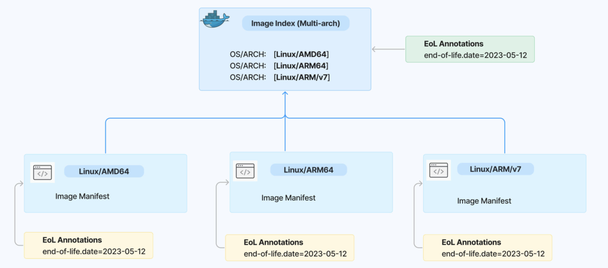

# Multi-arch image management with ORAS

## Overview

A multi-architecture (multi-arch) image is a type of container image that may combine variants for different architectures, and sometimes for different operating systems. In general, multi-arch images are commonly used in IoT and Edge computing, particularly heterogeneous deployments, as well as cross-platform environments.

When running an image with multi-architecture support, container clients will automatically select an image variant that matches your OS and architecture. Multi-arch images have been widely used in industry.

There are two formats of implementation in industry to create a multi-arch image:

- **Docker manifest list**: a manifest list is created from images that are identical in function for different OS/Arch combinations, e.g. [docker.io/ bitnami/kubectl:1.31](https://artifact-explorer.azurewebsites.net/artifact?image=docker.io/bitnami/kubectl:1.31). Note that there are some limitations to use Docker manifest list as articulated in the problems statement section below.
- **OCI image index**: a higher-level manifest which points to specific image manifests, ideal for one or more platforms, e.g. [ghcr.io/oras-project/oras:v1.2.0](https://artifact-explorer.azurewebsites.net/artifact?image=ghcr.io/oras-project/oras:v1.2.0) and [mcr.microsoft.com/oss/v2/open-policy-agent/gatekeeper:v3.17.0](https://mcr.microsoft.com/en-us/product/oss/v2/open-policy-agent/gatekeeper/tags)


As more and more container registries are fully compliant with the OCI Spec v1.1.0, OCI image index becomes a popular format to create a multi-arch image.

This document aims to elaborate on the scenarios and problems of creating and managing multi-arch images, propose a solution to resolve these problems and help users to effectively manage multi-arch images with ORAS.

## Target users

For users who need to create, store, update, and push multi-arch images locally and in OCI registry. The primary user persona are cloud-native developers.

## Scenarios and Problems

The `oras manifest` provides subcommands to push, fetch, and delete an image manifest, but it doesn’t support managing image index for a multi-arch image. This causes some problems and limitations to users when creating and managing multi-arch images as articulated below.

### Problem statement

Specifically, there are limitations and problems to create and manage multi-arch images using _docker_ or other registry clients:

#### Rely on remote registry

Users want to build a multi-arch image locally so that they can inspect and test the multi-arch images locally before publishing to the registry. Relying on a registry to create a multi-arch image also requires users to push each arch-specific image to the registry in advance. These arch-specific images are redundant to image builders and users.

However, [docker manifest create](https://docs.docker.com/reference/cli/docker/manifest/create/) requires users to build and push each platform-specific image to the registry, then composite all these images into a manifest list referenced by a tag. 

For example, a DevOps engineer Andy needs to manually create the image index using multiple arch-specific images separately from a registry, then composite these image manifests into a multi-arch image (OCI image index) and store it in an OCI image layout locally, finally push it to the registry. In fact, these platform-specific images are redundant in the registry since most of users consume and deploy the multi-arch image instead. It’s complex for him to maintain such a manual workflow and it's also inconvenient to rely on a remote registry when creating a multi-arch image.

#### Hard to composite and update a multi-arch image

To create a multi-arch image, ORAS users have to manually composite an OCI image index from one or several manifest JSON files, then use “oras manifest push” to push it to an OCI layout or a registry. Typical examples can be found from these two scripts:

- ORAS user A: [POC: Create and install Postgres Trunk Binaries (github.com)](https://gist.github.com/theory/7dc164e5772cae652d838a1c508972ae#file-push_trunk-L22) and his blog post [POC: Distributing Trunk Binaries via OCI (justatheory.com)](https://justatheory.com/2024/06/trunk-oci-poc/)
- ORAS user B: [Script to help create a simple mult-arch artifact (github.com)](https://gist.github.com/sajayantony/0c9d6436c03d531b1bbebe43249381cf)

#### Docker Buildx/Docker is unavailable

Users cannot install or use docker buildx plugin or even no Docker in some strict environments. For example, Bob needs to create multi-arch images in a strict air-gapped environemnt without Docker/Buildx installed by default. Bob needs to seek for an alternative tool to create a mulit-arch image locally.

#### Hard to annotate an existing multi-arch image

A security engineer Cindy needs to use image lifecycle annotations with ORAS to mark when the vulnerable image should be considered end of life (EoL) and no longer used by dependent services. 
However, as there are multi-arch images and separate arch-specific images maintained by service teams, it is cumbersome that they can only apply annotations manually to each arch-specific image separately instead of the multi-arch image. Most consumers of multi-arch images only interact with the parent image index for tagging and deployment. The EoL annotation is not available on the multi-arch image (index), which makes the multi-arch image (index) unverifiable.


#### Hard to inspect a multi-arch image locally

It’s hard to inspect a multi-arch image’s manifest content locally since docker buildx stores the multi-arch image in Docker’s build cache. David is a sofware engineer who needs to tag and push the multi-arch image to a registry after build. He also wants to inspect the multi-arch image locally before the release. It makes the multi-arch image a black box, which is hard for local testing.

## Proposed solution

Ideally, if ORAS extends the ability to manage a multi-arch image by introducing create, update, and annotate a multi-arch image, the problems listed above can be resolved. Managing an image index for a multi-arch image should be as easy as playing Legos. 

The proposed CLI commands for managing a multi-arch image are listed below. The detailed use case and subcommands are articulated in the CLI Spec section.

- Create a multi-arch image using OCI image index: `oras manifest index create`
- Update a multi-arch image using OCI image index: `oras manifest index update`
- Inspect a multi-arch image using OCI image index: `oras manifest inspect`
- Annotate a multi-arch image using OCI image index: `oras manifest create/update --annotation`
- List platform information of tags in a repository: `oras repo tags`

The proposal uses an OCI image layout as the local store to create a multi-arch image as an OCI image index locally, then push the multi-arch image to the remote registry with ORAS.  

### User scenario and desired experience

The sample workflow will be as following:

1. Assume there are two arch-specific images tagged as _“v1-linux-amd64”_ and _“v1-linux-arm64” and have been pushed to an OCI image layout _layout-dir_. List the tags in the OCI image layout:

```bash
$ oras repo tags --oci-layout layout-dir 

v1-linux-amd64 
v1-linux-arm64 
```

2. Create a multi-arch image by composing two image manifests into an image index, tag it with “v1” and push the image index to an OCI image layout “layout-dir” automatically:  

```
$ oras manifest index create --oci-layout layout-dir:v1 v1-linux-amd64 v1-linux-arm64 

Resolving  v1-linux-amd64 
Resolved   v1-linux-amd64 
Resolving  v1-linux-arm64 
Resolved   v1-linux-arm64 
Packed     edb5bc1f0b5c application/vnd.oci.image.index.v1+json 
Pushed     [oci-layout] layout-dir:v1 
Digest: sha256:edb5bc1f0b5c21e9321b34e50c92beae739250fb8840905 

An image index has been created and pushed to layout-dir:v1 
```

3. Inspect the image index from the OCI image layout: 

```bash
$ oras manifest fetch --oci-layout layout-dir:v1 --pretty  

{ 
  "schemaVersion": 2, 
  "mediaType": "application/vnd.oci.image.index.v1+json", 
  "manifests": [ 
    { 
      "mediaType": "application/vnd.oci.image.manifest.v1+json", 
      "digest": "sha256:42c524c48e0672568dbd2842d3a0cb34a", 
      "size": 1239, 
      "platform": { 
        "architecture": "amd64", 
        "os": "linux" 
      } 
    }, 
    { 
      "mediaType": "application/vnd.oci.image.manifest.v1+json", 
      "digest": "sha256:965945e1a08031a63d5970c1da7c39af231c36e4c0a", 
      "size": 1239, 
      "platform": { 
        "architecture": "arm64", 
        "os": "linux" 
      } 
    } 
  ] 
} 
```

4. Add (or change) annotations to an image index in the OCI layout: 

```bash
$ oras manifest index update --oci-layout layout-dir:v1 --annotation “platform=multi-arch” 

Resolving  v1 
Resolved   sha256:2af402374d4c9297bf077b1e722d523c5ce37256d1d04 
Updating anootation  v1 
Updated    sha256:447c006400aae8b0d302cafba172f5da9889d50af085a 
Pushed     [oci-layout] layout-dir:v1 
Digest: sha256:447c006400aae8b0d302cafba172f5da9889d50af085a 
Updated annotations of layout-dir:v1 
```

5. Attach an annotation as a referrer to an existing multi-arch image and its child arch-specific image manifest (without mutating its digest) in one shot. The same annotation is supposed to be added to the parent image index and its child arch-specific image manifest recursively: 


```bash
oras attach --artifact-type application/vnd.artifact.lifecycle  --annotation "vnd.artifact.lifecycle.end-of-life.date=2023-05-12" --oci-layout layout-dir:v1  

Attached to [oci-layout] layout-dir@sha256:2af402374d4c9297bf077b1e722d52 
Digest: sha256:117308d626166e77ffbd9c76b5545101b723csdcxcxc2344556642 
```

6. View attached annotations of the multi-arch image (index) and its child image manifest: 
 
```bash
$ oras discover --oci-layout layout-dir:v1 --recursive --format tree-full  

Image index
layout-dir@sha256:447c006400aae8b0d302cafba172f5da9889d50af085ad51d 
└── application/vnd.artifact.lifecycle 
    └── sha256:b25b53b7df86a5dc7087cf96ed88fd1d8872271422224d7 
        └── vnd.artifact.lifecycle.end-of-life.date: "2023-05-12

Image manifest [1] 
layout-dir@sha256:447c006400aae8b0d302caf9d50af089d50af089d50af089d 
└── application/vnd.artifact.lifecycle 
    └── sha256:b25b53b7df86a5dc7087cf96ed88fd1d8872271422224d7 
        └── vnd.artifact.lifecycle.end-of-life.date: "2023-05-12" 

 

Image manifest [2] 
layout-dir@sha256:447c006400aae8b0d302cafba172f5da9889d50af085ad51d 
└── application/vnd.artifact.lifecycle 
    └── sha256:b25b53b7df86a5dc7087cf96ed88fd1d8872271422224d7 
        └── vnd.artifact.lifecycle.end-of-life.date: "2023-05-12" 

```



1. List the tags in the OCI image layout. The digest and platform information should be listed alongside the tags. 

```bash
$ oras repo tags --oci-layout layout-dir 
```


| Tag  | Digest  | Platform   |
|--- | --- |  ---  |
| v1 | sha:256@xxxx | multi-arch (linux/amd64, linux/arm64)  |
| v1-linux-amd64  |    sha:256@yyyy          |     linux/amd64   |
| v1-linux-arm64  |    sha:256@zzzz          |     linux/arm64   |

8. Push the multi-arch image and its associated referrer EoL annotation to the registry. 

```bash
$ oras cp --from-oci-layout  layout-dir:v1 ghcr.io/oras/sample-app:v1 -r 

Copied [oci-layout] layout-dir:v1 => [registry] ghcr.io/oras/sample-app:v1
Digest: sha256:447c006400aae8b0d302cafba172f5da9889d50af085ad51de8eb87afb1a3cf0  
```

9. Check the media type and referrers on the registry. The multi-arch image has been pushed to the registry as an OCI image index format, along with the EOL annotation referrer. 

## CLI Specs for new subcommands 

### Create a multi-arch image

```bash
# Create an index from source manifests tagged 'linux-amd64' and 'linux-arm64', and push without tagging:
  oras manifest index create localhost:5000/hello linux-amd64 linux-arm64

# Create an index from source manifests tagged 'linux-amd64' and 'linux-arm64', and push with the tag 'v1':
  oras manifest index create localhost:5000/hello:v1 linux-amd64 linux-arm64

# Create an index from source manifests using both tags and digests, and push with tag 'v1':
  oras manifest index create localhost:5000/hello:v1 linux-amd64 sha256:99e4703fbf30916f549cd6bfa9cdbab614b5392fbe64fdee971359a77073cdf9

# Create an index and push it with multiple tags:
  oras manifest index create localhost:5000/hello:tag1,tag2,tag3 linux-amd64 linux-arm64 sha256:99e4703fbf30916f549cd6bfa9cdbab614b5392fbe64fdee971359a77073cdf9

# Create and push an index with annotations:
  oras manifest index create localhost:5000/hello:v1 linux-amd64 --annotation "key=val"

# Create an index and push to an OCI image layout folder 'layout-dir' and tag with 'v1':
  oras manifest index create layout-dir:v1 linux-amd64 sha256:99e4703fbf30916f549cd6bfa9cdbab614b5392fbe64fdee971359a77073cdf9

# Create an index and save it locally to index.json, auto push will be disabled:
  oras manifest index create --output index.json localhost:5000/hello linux-amd64 linux-arm64

# Create an index and output the index to stdout, auto push will be disabled:
  oras manifest index create localhost:5000/hello linux-arm64 --output - --pretty

```

### Update a multi-arch image

```bash
# Remove a manifest and add two manifests from an index tagged 'v1'. The tag will point to the updated index:
  oras manifest index update localhost:5000/hello:v1 --add linux-amd64 --add linux-arm64 --remove sha256:99e4703fbf30916f549cd6bfa9cdbab614b5392fbe64fdee971359a77073cdf9

# Create a new index by updating an existing index specified by its digest:
  oras manifest index update localhost:5000/hello@sha256:99e4703fbf30916f549cd6bfa9cdbab614b5392fbe64fdee971359a77073cdf9 --add linux-amd64 --remove sha256:fd6ed2f36b5465244d5dc86cb4e7df0ab8a9d24adc57825099f522fe009a22bb

# Merge manifests from the index 'v2-windows' to the index 'v2':
  oras manifest index update localhost:5000/hello:v2 --merge v2-windows

# Update an index and tag the updated index as 'v2.1.0' and 'v2':
  oras manifest index update localhost:5000/hello@sha256:99e4703fbf30916f549cd6bfa9cdbab614b5392fbe64fdee971359a77073cdf9 --add linux-amd64 --tag "v2.1.0" --tag "v2"

# Update an index and save it locally to index.json, auto push will be disabled:
  oras manifest index update --output index.json localhost:5000/hello:v2 --add v2-linux-amd64

# Update an index and output the index to stdout, auto push will be disabled:
  oras manifest index update --output - --pretty localhost:5000/hello:v2 --remove sha256:99e4703fbf30916f549cd6bfa9cdbab614b5392fbe64fdee971359a77073cdf9
```

### Annotate a multi-arch image

```bash
# Add annotations to an image image via key and value
oras manifest index update --oci-layout layout-dir:v1 --annotation “platform=multi-arch” 

# Attach an annotation as a referrer to an OCI image index and its child image recursively
oras attach --artifact-type application/vnd.rabbitnetworks.artifact.lifecycle --annotation "vnd.rabbitnetworks.artifact.lifecycle.end-of-life.date=2023-05-12" layout.tar:v1 --recursive
```

### Inspect a multi-arch image

### List tag-based arch/platform information in a repo

```
oras repo tags --oci-layout layout-dir 
```

| Tag  | Digest  | Platform   |
|--- | --- |  ---  |
| v1 | sha:256@xxxx | multi-arch (linux/amd64, linux/arm64) |
| v1-linux-amd64  |    sha:256@yyyy          |     linux/amd64   |
| v1-linux-arm64  |    sha:256@zzzz          |     linux/arm64   |


## Investigation on other client tools and industry

Most of popular container client tools support create and push a multi-arch image using Docker manifest list or OCI image index format, but these tools **require users to push platform-specific image to the registry separately**. They don’t provide native support for local build experience.

- **Docker**:
  - [Docker buildx buildx](https://docs.docker.com/reference/cli/docker/buildx/build/)
  - [Docker buildx imagetool](https://docs.docker.com/reference/cli/docker/buildx/imagetools/)
  - [Docker manifest create](https://docs.docker.com/reference/cli/docker/manifest/)
- **Podman (Backed by Red Hat)**: similar with “docker manifest”, it provides _“podman manifest”_ with subcommands to create and manipulate manifest lists and image indexes
- Crane **(Backed by Google)**: provides a single command [_“crane index append”_](https://github.com/google/go-containerregistry/blob/main/cmd/crane/recipes.md#create-a-multi-platform-image-from-scratch) to composite an image index
- **Regctl (Individual)** provides [_“regctl index add/create/delete”_](https://github.com/regclient/regclient/blob/main/docs/regctl.md#index-commands) to creates or manages OCI Indexes and Manifest Lists
- **manifest-tool (Individual from AWS):** create Docker manifest list or OCI image index in a registry by using the [**_manifest-tool_** **_push_** command with either a YAML file describing the images to assemble or by using a series of parameters](https://github.com/estesp/manifest-tool?tab=readme-ov-file#sample-usage).
- **Skopeo (Backed by Red Hat)**: doesn’t support OCI image index and Docker manifest list

Based on the industry observation, Docker buildx plugin supports building a multi-arch image using the OCI image index format. Even [Docker Official Images](https://docs.docker.com/trusted-content/official-images/) are using the OCI image index format to create multi-platform images.

[Homebrew](https://github.com/orgs/Homebrew/packages) publishes all images on ghcr.io using OCI image index. Docker provides two ways to build a multi-arch image, i.e. _“_[_docker manifest_](https://docs.docker.com/reference/cli/docker/manifest/)_”_ and _“_[_docker buildx_](https://docs.docker.com/reference/cli/docker/buildx/build/)_”._ However, there are some limitations and problems of using Docker to build multi-arch images in certain scenarios and environments.

## Open Questions

- Is multi-arch artifact in the scope of the `oras manifest` subcommands? Is the multi-arch artifact popular in the industry?
- Should ORAS support creating Docker manifest list?
- Is ORAS supposed to add flags “--artifact-type” and `--subject` to `oras manifest index create`?

## Appendix 

### PoC 

The PoC is used for demonstration and testing purposes. Note that the PoC is not the ultimate version and be left behind this spec. It will be updated accordingly based on this spec. 

#### Create a multi-arch image as an OCI image index locally

Preview it on [](https://asciinema.org/a/677877).

#### Update an existing OCI image index: add, remove, merge

Preview it on [](https://asciinema.org/a/677890).