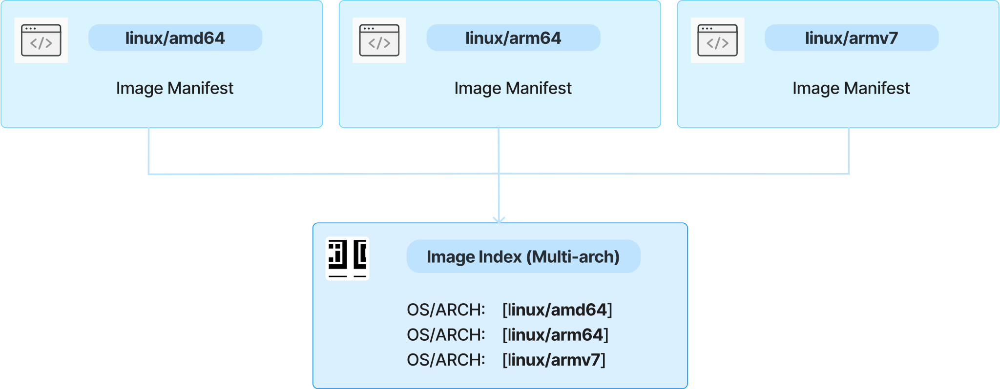
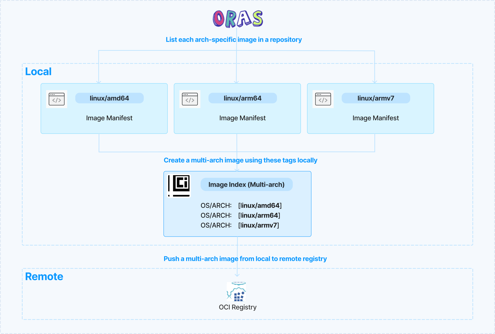

# Multi-platform artifact management with ORAS

> [!NOTE]
> The version of this specification is `1.3.0-beta.3`. It is subject to change until ORAS v1.3.0 is officially released. 

## Overview

A multi-architecture (multi-arch) image is a type of container image that may combine variants for different architectures, and sometimes for different operating systems. In general, multi-arch images are commonly used in IoT and Edge computing, particularly heterogeneous deployments, as well as cross-platform environments.

When running an image with multi-architecture support, container clients will automatically select an image variant that matches your OS and architecture. Multi-arch images have been widely used in industry.

There are two formats of implementation in industry to create a multi-arch image:

- **Docker manifest list**: a manifest list is created from images that are identical in function for different OS/Arch combinations, e.g. [docker.io/bitnami/kubectl:1.31](https://artifact-explorer.azurewebsites.net/artifact?image=docker.io/bitnami/kubectl:1.31). Note that there are some limitations to use Docker manifest list as articulated in the problems statement section below.
- **OCI image index**: a higher-level manifest which points to specific image manifests, ideal for one or more platforms, e.g. [ghcr.io/oras-project/oras:v1.2.0](https://artifact-explorer.azurewebsites.net/artifact?image=ghcr.io/oras-project/oras:v1.2.0).



As more and more container registries are fully compliant with the OCI specifications, OCI image index becomes a popular format to create a multi-arch image.

This concept can also be generalized to other artifact types that require separate manifests for each supported platform, beyond just container images. Whereas container images are often built just for Linux systems and vary only by CPU architecture, other artifact types can be used in different ways and so we use the broader term "Multi-platform artifact" (as opposed to _multi-architecture_) for that situation.

This document aims to elaborate on the scenarios and problems of creating and managing multi-platform artifacts, propose a solution to resolve these problems and help users to effectively create and manage multi-platform artifacts with ORAS.

## Target users

For users who need to create, store, update, and push multi-arch images locally and in OCI registries. The primary user persona includes cloud-native developers, DevOps engineers, and security engineers.

## Problem Statement

The `oras manifest` provides subcommands to push, fetch, and delete an image manifest, but it doesn’t support composing an image index for a multi-platform artifact. This causes some problems and limitations to users as articulated below when creating multi-platform artifacts.

### Problem statement

Specifically, there are limitations and problems to create and manage multi-platform artifacts using `docker` or `docker buildx`:

#### Rely on remote registry to create a multi-arch image

[`docker manifest`](https://docs.docker.com/reference/cli/docker/manifest/create/) and [`docker buildx imagetools create`](https://docs.docker.com/reference/cli/docker/buildx/imagetools/create/) requires the separate arch-specific images (with different architectures/variants) to be pushed to a registry before creating an image index or manifest list. Normally, developers want to create a multi-arch image locally so that they can test in a development environment before publishing to the registry. This is not efficient for local development and testing.  Moreover, relying on a remote registry to create a multi-arch image is not acceptable in an air-gapped environment.

In addition, `docker buildx` relies on a remote builder for the target architectures which do not match the build machine. Using a remote builder is not convenient and secure enough for testing changes. 

#### Hard to compose and update a multi-arch image

To create a multi-arch image, ORAS users have to manually compose an OCI image index from one or several manifest JSON files, then use "oras manifest push" to push it to an OCI layout or a registry. Typical examples can be found from these two scripts:

- ORAS user A: [POC: Create and install Postgres Trunk Binaries (github.com)](https://gist.github.com/theory/7dc164e5772cae652d838a1c508972ae#file-push_trunk-L22) and his blog post [POC: Distributing Trunk Binaries via OCI (justatheory.com)](https://justatheory.com/2024/06/trunk-oci-poc/)
- ORAS user B: [Script to help create a simple multi-arch artifact (github.com)](https://gist.github.com/sajayantony/0c9d6436c03d531b1bbebe43249381cf)

#### `docker buildx`/`docker` is unavailable

Users are not able to install or use `docker buildx` or even no `docker` and its daemon service in some strict environments. Users need to seek an alternative tool to create a multi-arch image without relying on `docker` or `docker buildx`.
## Scenarios

### Create a multi-arch image in local filesystem

Bob is a DevOps engineer. He wants to create a multi-arch image in an air-gapped environment with strict isolation, meaning all resources must reside in the local filesystem, with no access to a container registry. Each architecture-specific image manifest has already been created and stored locally. Bob wants to use the `oras` client to assemble a multi-arch image by creating an OCI image index that references these existing arch-specific images. Once the multi-arch image is assembled, Bob will verify and test it locally to ensure correctness.

### Create a multi-arch image from registry only

Bob wants to create a multi-arch image using arch-specific images stored in a remote container registry. Each architecture-specific image has already been pushed to the registry. Bob aims to use the `oras` client to assemble these remote images into a multi-arch image using an OCI image index, without downloading them to the local filesystem. After successfully creating the multi-arch image, Bob will push the final multi-arch to the registry for further use.

### Create a multi-arch image from local and registry

Bob wants to create a multi-arch image by combining architecture-specific images stored in both a local filesystem and a remote registry. Bob has already created some arch-specific image manifests and stored them locally, while others exist in a container registry. He wants to use the `oras` client to create a multi-arch image using an OCI image index, incorporating both local and remote images. Once created, Bob will push the final multi-arch image to a remote registry for distribution and testing.

### Update an existing multi-arch image

Bob needs to update an existing multi-arch image by replacing or adding architecture-specific images. The current multi-arch image is stored either in a local filesystem or a remote registry. Bob has created new arch-specific images that need to be incorporated into the existing OCI image index. Using the `oras` client, he plans to:

- Retrieve the existing multi-arch image to local
- Modify the image index: He will replace outdated architecture-specific images with new ones or append additional architectures as needed.
- Push the updated multi-arch image: Once modified, he will save the updated image index locally or push it to a registry for further use.
- Verify the update: Finally, Bob will inspect the updated image to confirm that the changes were applied successfully.

Bob expects `oras` client to streamline the updating process above. This ensures that Bob can efficiently manage multi-arch images while maintaining version consistency.

### Annotate a multi-arch image

This scenario will be included in a separate proposal doc.

### Build multi-platform indexes for other artifact types

Existing tools like `docker buildx` often prioritize container images in particular and lack support for other artifact types.

Multi-platform artifacts use the `artifactType` property on both the child manifests and on the index manifest itself to help differentiate between different artifact types. Users of systems that use non-container-image artifacts need a tool that is able to populate the index manifest `artifactType` property with a specific value, and to include the `artifactType` property in the descriptors for child manifests.

## Proposals

Ideally, if ORAS extends the ability to create and manage a multi-arch image from either local environment or remote registry, the problems listed above can be resolved. Creating and managing a multi-arch image using image index format should be as easy as playing Legos. With a small set of additional features ORAS can also effectively support multi-platform artifacts that are not container images.

The proposed CLI commands for managing a multi-platform artifact are listed below. The detailed use cases and subcommands are articulated in the CLI Spec section.

- Create a multi-platform artifact: `oras manifest index create`
  - Add annotations to a multi-platform artifact during creation: `oras manifest index create --annotation`
- Update a multi-platform artifact: `oras manifest index update`
  
The proposal creates a multi-platform artifact using an OCI image index in an OCI image layout as a local storage, then push the multi-platform artifact to the registry with ORAS. 

### Desired experience

#### Create a multi-arch image in local filesystem

Here is the sample workflow to create a multi-arch image using an image index locally and push it to the registry for deployment:



1. Assume there are two arch-specific images tagged as `v1-linux-amd64` and `v1-linux-arm64` in an OCI image layout called `layout-dir`. List the tags in the OCI image layout:

```bash
$ oras repo tags layout-dir --oci-layout
v1-linux-amd64 
v1-linux-arm64
v1-linux-armv7
```

2. Create a multi-arch image by combining two image manifests into an image index, tag it with `v1` and push the tagged image index to an OCI image layout `layout-dir` automatically. Add annotations to this image index at the same time:  

```console
$ oras manifest index create layout-dir:v1 v1-linux-amd64 v1-linux-arm64 --oci-layout --annotation "com.example.key=value" 
Fetching  v1-linux-amd64 
Fetched   sha256:42c524c48e0672568dbd2842d3a0cb34a415347145ee9fe1c8abaf65e7455b46 v1-linux-amd64 
Fetching  v1-linux-arm64
Fetched   sha256:965945e1a08031a63d5970c1da7c39af231c36e4c0a5a3cc276d02a3e06513ee v1-linux-arm64 
Packed    edb5bc1f0b5c application/vnd.oci.image.index.v1+json
Pushed    [oci-layout] layout-dir:v1
Digest: sha256:edb5bc1f0b5c21e9321b34e50c92beae739250fb88409056e8719d9759f6b5b4
```

3. View the image index in the OCI image layout in a pretty JSON output: 

```console
$ oras manifest fetch layout-dir:v1 --oci-layout --pretty  
{
  "schemaVersion": 2,
  "mediaType": "application/vnd.oci.image.index.v1+json",
  "manifests": [
    {
      "mediaType": "application/vnd.oci.image.manifest.v1+json",
      "digest": "sha256:42c524c48e0672568dbd2842d3a0cb34a415347145ee9fe1c8abaf65e7455b46",
      "size": 1239,
      "platform": {
        "architecture": "amd64",
        "os": "linux"
      }
    },
    {
      "mediaType": "application/vnd.oci.image.manifest.v1+json",
      "digest": "sha256:965945e1a08031a63d5970c1da7c39af231c36e4c0a5a3cc276d02a3e06513ee",
      "size": 1239,
      "platform": {
        "architecture": "arm64",
        "os": "linux"
      }
    }
  ],
  "annotations": {
    "com.example.key": "value"
  }
}
```

#### Create a multi-arch image from a registry only

Create a multi-arch image using two arch-specific images stored in a registry only, tag it with `v1` and push the tagged image index to a registry automatically.

```console
$ oras manifest index create localhost:5000/example:v1 v1-linux-amd64 v1-linux-arm64
Fetching  v1-linux-amd64 
Fetched   sha256:42c524c48e0672568dbd2842d3a0cb34a415347145ee9fe1c8abaf65e7455b46 v1-linux-amd64 
Fetching  v1-linux-arm64
Fetched   sha256:965945e1a08031a63d5970c1da7c39af231c36e4c0a5a3cc276d02a3e06513ee v1-linux-arm64 
Packed    edb5bc1f0b5c application/vnd.oci.image.index.v1+json
Pushed    localhost:5000/example:v1
Digest: sha256:edb5bc1f0b5c21e9321b34e50c92beae739250fb88409056e8719d9759f6b5b4
```

#### Create a multi-arch image from local and registry

Users need to pull the target arch-specific image to the local repository or OCI image layout, then use `oras manifest index create` to create a multi-arch image.  

Each arch-specific image is supposed to be stored in the same repository to assemble a multi-arch image. The image index acts as a pointer to different arch-specific images, and most OCI registries do not support cross-repository image references in an image index. Keeping all variants in the same repository ensures the registry can resolve and serve the correct architecture. 

```console
$ oras copy --to-oci-layout ghcr.io/example:v1-linux-amd64 example:v1-linux-amd64
Copied [registry] ghcr.io/example:v1-linux-amd64 => [oci-layout] example:v1-linux-amd64
Digest: sha256:cd549d80c4aa89638aea5964a3cd8193a6dd8abf939a43b5d562c24dbab08ff1
```

```console
$ oras manifest index create example:v1 v1-linux-amd64 v1-linux-arm64 --oci-layout
Fetching  v1-linux-amd64 
Fetched   sha256:42c524c48e0672568dbd2842d3a0cb34a415347145ee9fe1c8abaf65e7455b46 v1-linux-amd64 
Fetching  v1-linux-arm64
Fetched   sha256:965945e1a08031a63d5970c1da7c39af231c36e4c0a5a3cc276d02a3e06513ee v1-linux-arm64 
Packed    edb5bc1f0b5c application/vnd.oci.image.index.v1+json
Pushed    [oci-layout] example:v1
Digest: sha256:edb5bc1f0b5c21e9321b34e50c92beae739250fb88409056e8719d9759f6b5b4
```

#### Update an existing multi-arch image in either a registry or local filesystem

Update the image index by adding a new architecture. These two arch-specific images must be either in a registry or an OCI image layout. Taking OCI image layout as an example: 

```console
$ oras manifest index update layout-dir:v1 --oci-layout --add v1-linux-armv7
Fetching  v1
Fetched   sha256:edb5bc1f0b5c21e9321b34e50c92beae739250fb88409056e8719d9759f6b5b4 v1
Fetching  v1-linux-armv7
Fetched   sha256:965945e1a08031a63d5970c1da7c39af231c36e4c0a5a3cc276d02a3e06513ee v1-linux-armv7
Added     sha256:965945e1a08031a63d5970c1da7c39af231c36e4c0a5a3cc276d02a3e06513ee v1-linux-armv7
Updated   sha256:6a165dbdc7a24e677e7ec0748457604ba143ae74e5b27a19789b88b41bf49bb0
Pushed    [oci-layout] layout-dir:v1
Digest: sha256:6a165dbdc7a24e677e7ec0748457604ba143ae74e5b27a19789b88b41bf49bb0
```

#### Create a multi-platform artifact with specific `artifactType` values

For non-container-image artifacts there are two main concerns:

- The index manifest must have a specific value in its `artifactType` field indicating the type of the overall multi-platform artifact.
- If any of the child manifests also have `artifactType` properties themselves, their values should be reflected in the descriptors in the index manifest so that clients can efficiently select only the specific artifact types they are expecting.

`oras push` already supports an `--artifact-type` option which allows setting `artifactType` when creating the image manifest for a leaf object. The `oras manifest index` subcommands shall automatically copy this value from each child manifest, if defined, when building the index descriptors.

The `oras manifest index create` command also supports the same `--artifact-type` option, causing it to set the top-level `artifactType` property in the generated index manifest.

The `oras manifest index update` command supports the same option but treats its presence as a request to _change_ the existing `artifactType`:

1. `oras manifest index update` without any `--artifact-type` option retains whatever value was already set for `artifactType` in the source manifest, if any.
2. `oras manifest index update --artifact-type=application/vnd.example` overwrites any existing `artifactType` value in the source manifest with the given value `"application/vnd.example"`.
3. `oras manifest index update --artifact-type=""` removes any existing `artifactType` value in the source manifest, so that the new index does not include the `artifactType` property at all.

## CLI Specs for new subcommands 

### Create a multi-platform artifact

```bash
# Create an index from source manifests tagged 'linux-amd64' and 'linux-arm64', and push without tagging:
oras manifest index create localhost:5000/hello linux-amd64 linux-arm64

# Create an index from source manifests tagged 'linux-amd64' and 'linux-arm64', and push with the tag 'v1':
oras manifest index create localhost:5000/hello:v1 linux-amd64 linux-arm64

# Create an index from source manifests using both tags and digests, and push with tag 'v1':
oras manifest index create localhost:5000/hello:v1 linux-amd64 sha256:99e4703fbf30916f549cd6bfa9cdbab614b5392fbe64fdee971359a77073cdf9

# Create an index and push it with multiple tags:
oras manifest index create localhost:5000/hello:tag1,tag2,tag3 linux-amd64 linux-arm64 sha256:99e4703fbf30916f549cd6bfa9cdbab614b5392fbe64fdee971359a77073cdf9

# Create and push an index with annotations:
oras manifest index create localhost:5000/hello:v1 linux-amd64 --annotation "key=val"

# Create an index with a specified artifact type:
oras manifest index create --artifact-type="application/vnd.example+type" localhost:5000/hello linux-amd64

# Create an index and push to an OCI image layout folder 'layout-dir' and tag with 'v1':
oras manifest index create layout-dir:v1 linux-amd64 sha256:99e4703fbf30916f549cd6bfa9cdbab614b5392fbe64fdee971359a77073cdf9 --oci-layout

# Create an index and save it locally to index.json, auto push will be disabled:
oras manifest index create --output index.json localhost:5000/hello linux-amd64 linux-arm64

# Create an index and output the index to stdout, auto push will be disabled:
oras manifest index create localhost:5000/hello linux-arm64 --output - --pretty

```

### Update a multi-platform artifact

```bash
# Remove a manifest and add two manifests from an index tagged 'v1'. The tag will point to the updated index:
oras manifest index update localhost:5000/hello:v1 --add linux-amd64 --add linux-arm64 --remove sha256:99e4703fbf30916f549cd6bfa9cdbab614b5392fbe64fdee971359a77073cdf9

# Create a new index by updating an existing index specified by its digest:
oras manifest index update localhost:5000/hello@sha256:99e4703fbf30916f549cd6bfa9cdbab614b5392fbe64fdee971359a77073cdf9 --add linux-amd64 --remove sha256:fd6ed2f36b5465244d5dc86cb4e7df0ab8a9d24adc57825099f522fe009a22bb

# Merge manifests from the index 'v2-windows' to the index 'v2':
oras manifest index update localhost:5000/hello:v2 --merge v2-windows

# Update an index and tag the updated index as 'v2.1.0' and 'v2':
oras manifest index update localhost:5000/hello@sha256:99e4703fbf30916f549cd6bfa9cdbab614b5392fbe64fdee971359a77073cdf9 --add linux-amd64 --tag "v2.1.0" --tag "v2"

# Update an index and save it locally to index.json, auto push will be disabled:
oras manifest index update --output index.json localhost:5000/hello:v2 --add v2-linux-amd64

# Update an index and output the index to stdout, auto push will be disabled:
oras manifest index update --output - --pretty localhost:5000/hello:v2 --remove sha256:99e4703fbf30916f549cd6bfa9cdbab614b5392fbe64fdee971359a77073cdf9

# Update an index to use a different artifact type:
oras manifest index update localhost:5000/hello:v1 --artifact-type="application/vnd.example+type"

# Update an index to remove any existing artifact type:
oras manifest index update localhost:5000/hello:v1 --artifact-type=""
```

### View a multi-platform artifact

To make view operation more intuitive to users, add one alias `oras manifest show` to the existing command `oras manifest fetch`:

```bash
Usage:
  oras manifest fetch [flags] <name>{:<tag>|@<digest>}

Aliases:
  fetch, get, show
```

## Index manifest structure

The `oras manifest index` family of commands manipulates index manifests as described in [OCI Image Index Specification](https://github.com/opencontainers/image-spec/blob/v1.1.1/image-index.md).

The image index properties defined in that specification are populated as follows:

- `schemaVersion`: always set to `2`, as the specification requires.
- `mediaType`: always set to `"application/vnd.oci.image.index.v1+json"` to distinguish from other manifest types, as the specification requires.
- `artifactType`: set to the value provided in argument to the `--artifact-type` option if present and non-empty, or omitted otherwise.
- `manifests`: an array of descriptors describing each of the child manifests selected by tag or digest on the `oras manifest index create` command line, or subsequently added using options like `oras manifest index update --add`.

    The descriptor for each child manifest is populated as follows:

    - `mediaType`: set to match the `mediaType` property of the associated manifest.
    - `artifactType`: set to match the `artifactType` property of the associated manifest, if any.

      If the associated manifest was also created using ORAS, this property would've been set using the `--artifact-type` option when running an earlier command such as `oras push`.
    - `digest`: set to a blob digest of the associated manifest.
    - `size`: set to the size of the blob containing the associated manifest, in bytes.
    - `platform`: describes a specific platform specified in the associated manifest.

      If the associated manifest was also created using ORAS, the information used to populate this property would've been set using the `--artifact-platform` option when running an earlier command such as `oras push`.

      `oras push` currently uses the experimental approach of storing the target platform information in the configuration blob associated with the image manifest. Alternative approaches are currently under discussion in [opencontainers/image-spec#1216](https://github.com/opencontainers/image-spec/issues/1216) and may be adopted in a later version of this proposal.

    No other descriptor properties are included.
- `subject`: always omitted.
- `annotations`: populated based on the `--annotation` command line option, if present.

## Investigation on other client tools and industry

Most of popular container client tools support create and push a multi-arch image using docker manifest list or OCI image index format, but these tools **require users to push platform-specific image push to the registry separately**. They don’t provide native support for local environment.

- **docker**:
  - [docker buildx build](https://docs.docker.com/reference/cli/docker/buildx/build/)
  - [docker buildx imagetool](https://docs.docker.com/reference/cli/docker/buildx/imagetools/)
  - [docker manifest create](https://docs.docker.com/reference/cli/docker/manifest/)
- **podman (Backed by Red Hat)**: similar with `docker manifest`, it provides `podman manifest` with subcommands to create and manipulate manifest lists and image indexes.
- **buildah**: supports building a multi-platform image to [local filesystem](https://github.com/containers/buildah/blob/main/docs/buildah-build.1.md#building-an-image-using---output-custom-build-output.).
- **crane(Backed by Google)**: provides a single command [crane index append](https://github.com/google/go-containerregistry/blob/main/cmd/crane/recipes.md#create-a-multi-platform-image-from-scratch) to compose an image index. `crane index filter` supports filters the image index to include only platforms that are relevant to you.
- **regctl (Individual)** provides [regctl index add/create/delete](https://github.com/regclient/regclient/blob/main/docs/regctl.md#index-commands) to creates or manages OCI image index and manifest list, `regctl artifact put --index` supports pushing the artifact and add it to an index in a single operation. It also provides native support for local environments in all commands with the OCI Layout, and allows setting the `artifactType` property on generated indexes.
- **manifest-tool (Individual from AWS):** create docker manifest list or OCI image index in a registry by using the [manifest-tool push command with either a YAML file describing the images to assemble or by using a series of parameters](https://github.com/estesp/manifest-tool?tab=readme-ov-file#sample-usage).
- **skopeo (Backed by Red Hat)**: Skopeo can consume and copy image index or manifest list, but it doesn't support generating or modifying them.

In addition, `docker buildx` supports building a multi-arch image using the OCI image index format. Even [Docker Official Images](https://docs.docker.com/trusted-content/official-images/) are using the OCI image index format to create multi-platform images. [Homebrew](https://github.com/orgs/Homebrew/packages) publishes all images on ghcr.io using OCI image index. 

## Follow-up enhancements in the future releases

- Support showing platform information of tags in formatted output:  https://github.com/oras-project/oras/issues/1547
- Support attach annotations in `oras attach`: https://github.com/oras-project/oras/issues/1531
- Add status output to show the command execution result: https://github.com/oras-project/oras/issues/1575
