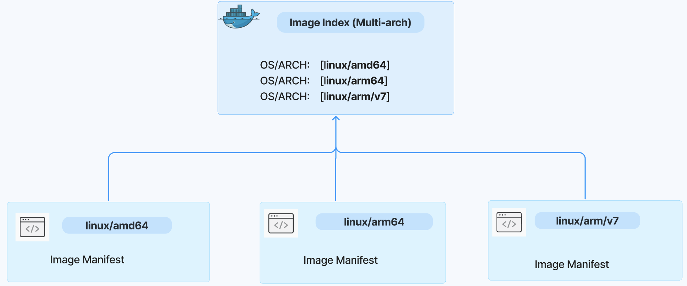

# Multi-arch image management with ORAS

> [!NOTE]
> The version of this specification is `1.3.0 Beta.1`. It is subject to change until ORAS v1.3.0 is officially released. 

## Overview

A multi-architecture (multi-arch) image is a type of container image that may combine variants for different architectures, and sometimes for different operating systems. In general, multi-arch images are commonly used in IoT and Edge computing, particularly heterogeneous deployments, as well as cross-platform environments.

When running an image with multi-architecture support, container clients will automatically select an image variant that matches your OS and architecture. Multi-arch images have been widely used in industry.

There are two formats of implementation in industry to create a multi-arch image:

- **Docker manifest list**: a manifest list is created from images that are identical in function for different OS/Arch combinations, e.g. [docker.io/bitnami/kubectl:1.31](https://artifact-explorer.azurewebsites.net/artifact?image=docker.io/bitnami/kubectl:1.31). Note that there are some limitations to use Docker manifest list as articulated in the problems statement section below.
- **OCI image index**: a higher-level manifest which points to specific image manifests, ideal for one or more platforms, e.g. [ghcr.io/oras-project/oras:v1.2.0](https://artifact-explorer.azurewebsites.net/artifact?image=ghcr.io/oras-project/oras:v1.2.0).



As more and more container registries are fully compliant with the OCI specifications, OCI image index becomes a popular format to create a multi-arch image.

This document aims to elaborate on the scenarios and problems of creating and managing multi-arch images, propose a solution to resolve these problems and help users to effectively create and manage multi-arch images with ORAS.

## Target users

For users who need to create, store, update, and push multi-arch images locally and in OCI registries. The primary user persona is cloud-native developers.

## Scenarios and Problems

The `oras manifest` provides subcommands to push, fetch, and delete an image manifest, but it doesn’t support composing an image index for a multi-arch image. This causes some problems and limitations to users as articulated below when creating multi-arch images.

### Problem statement

Specifically, there are limitations and problems to create and manage multi-arch images using `docker` or `docker buildx`:

### Lack of native support for local environment

`docker buildx` confuses developers who are expecting to immediately run a multi-arch image after a successful build. Because `docker buildx` targets multiple architectures, it must be saved to a repository, not local storage. This requires the multi-arch image push to a repository and then a pull to run and test locally, which is inefficient for local development and testing.

In addition, `docker buildx` sometimes relies on a remote builder for the target architectures which do not match the build machine. Using a remote builder is also not convenient for testing changes. 

#### Rely on remote registry to create multi-arch image

[`docker manifest`](https://docs.docker.com/reference/cli/docker/manifest/create/) and [`docker buildx imagetools create`](https://docs.docker.com/reference/cli/docker/buildx/imagetools/create/) requires the separate arch-specific images (with different architectures/variants) to be pushed to a registry before creating an image index or manifest list. Normally, developers want to create a multi-arch image locally so that they can test in a development environment before publishing to the registry. 

This is not convenient for local development and testing. Moreover, relying on a remote registry to create a multi-arch image is not acceptable in an air-gapped environment.

#### Hard to compose and update a multi-arch image

To create a multi-arch image, ORAS users have to manually compose an OCI image index from one or several manifest JSON files, then use "oras manifest push" to push it to an OCI layout or a registry. Typical examples can be found from these two scripts:

- ORAS user A: [POC: Create and install Postgres Trunk Binaries (github.com)](https://gist.github.com/theory/7dc164e5772cae652d838a1c508972ae#file-push_trunk-L22) and his blog post [POC: Distributing Trunk Binaries via OCI (justatheory.com)](https://justatheory.com/2024/06/trunk-oci-poc/)
- ORAS user B: [Script to help create a simple mult-arch artifact (github.com)](https://gist.github.com/sajayantony/0c9d6436c03d531b1bbebe43249381cf)

#### `docker buildx`/`docker` is unavailable

Users are not able to install or use `docker buildx` or even no `docker` and its daemon service in some strict environments. Users need to seek for an alternative tool to create a mulit-arch image without relying on `docker` or `docker buildx`.

## Proposed solution

Ideally, if ORAS extends the ability to create and manage a multi-arch image from a local environment or a remote registry, the problems listed above can be resolved. Creating and managing a multi-arch image using image index format should be as easy as playing Legos. 

The proposed CLI commands for managing a multi-arch image are listed below. The detailed use cases and subcommands are articulated in the CLI Spec section.

- Create a multi-arch image: `oras manifest index create`
- Update a multi-arch image: `oras manifest index update`
- Inspect a multi-arch image: `oras manifest fetch`. Add two alias `oras manifest inspect` and `oras manifest show` for usability
- Add annotations to a multi-arch image: `oras manifest create --annotation`

The proposal creates a multi-arch image using an OCI image index in an OCI image layout as a local storage, then push the multi-arch image to the registry with ORAS. 

### User scenario and desired experience

The sample workflow will be as following:

1. Assume there are two arch-specific images tagged as `v1-linux-amd64` and `v1-linux-arm64` in an OCI image layout called `layout-dir`. List the tags in the OCI image layout:

```bash
$ oras repo tags --oci-layout layout-dir 

v1-linux-amd64 
v1-linux-arm64 
```

2. Create a multi-arch image by combining two image manifests into an image index, tag it with `v1` and push the tagged image index to an OCI image layout `layout-dir` automatically. Add annotations to this image index at the same time:  

```bash
$ oras manifest index create --oci-layout layout-dir:v1 v1-linux-amd64 v1-linux-arm64 --annotation "platform=multi-arch" 
```

```bash
Fetching  v1-linux-amd64 
Fetched   v1-linux-amd64 
Fetching  v1-linux-arm64 
Fetched   v1-linux-arm64 
Packed     edb5bc1f0b5c application/vnd.oci.image.index.v1+json 
Pushed     [oci-layout] layout-dir:v1 
Digest: sha256:edb5bc1f0b5c21e9321b34e50c92beae739250fb8840905 

Status: An image index has been created and pushed to layout-dir:v1 
```

3. Inspect the image index from the OCI image layout: 

```bash
$ oras manifest fetch --oci-layout layout-dir:v1 --pretty  
```

```json
{
  "schemaVersion": 2,
  "mediaType": "application/vnd.oci.image.index.v1+json",
  "manifests": [
    {
      "mediaType": "application/vnd.oci.image.manifest.v1+json",
      "digest": "sha256:42c524c48e0672568dbd2842d3a0cb34a415347145ee9fe1c8abaf65e7455b46",
      "size": 1239,
      "platform": {
        "architecture": "amd64",
        "os": "linux"
      }
    },
    {
      "mediaType": "application/vnd.oci.image.manifest.v1+json",
      "digest": "sha256:965945e1a08031a63d5970c1da7c39af231c36e4c0a5a3cc276d02a3e06513ee",
      "size": 1239,
      "platform": {
        "architecture": "arm64",
        "os": "linux"
      }
    }
  ],
  "annotations": {
    "platform": "multi-arch"
  }
}
```

4. Update the image index by adding a new architecture image in the OCI image layout: 

```bash
$ oras manifest index update --oci-layout layout-dir:v1 --add linux-arm/v7 
```

```bash
Fetching  v1
Fetched   sha256:aba7563dbb28dcbe91b4d24ec84028af4ad97cfaf0cdf3fa550e8d619d5f36d1 v1
Fetching  v1-linux-arm/v7
Fetched   sha256:42c524c48e0672568dbd2842d3a0cb34a415347145ee9fe1c8abaf65e7455b46 v1-linux-arm/v7
Added     sha256:42c524c48e0672568dbd2842d3a0cb34a415347145ee9fe1c8abaf65e7455b46 v1-linux-arm/v7
Updated   sha256:7c65e066ada2a43efea2610451502498368ce3dcceef3e3d47d8fdcf32f47c57
Pushed    [oci-layout] layout-dir:v1
Digest: sha256:7c65e066ada2a43efea2610451502498368ce3dcceef3e3d47d8fdcf32f47c57

Status: An image index has been updated and pushed to layout-dir:v1
```

## CLI Specs for new subcommands 

### Create a multi-arch image

```bash
# Create an index from source manifests tagged 'linux-amd64' and 'linux-arm64', and push without tagging:
oras manifest index create localhost:5000/hello linux-amd64 linux-arm64

# Create an index from source manifests tagged 'linux-amd64' and 'linux-arm64', and push with the tag 'v1':
oras manifest index create localhost:5000/hello:v1 linux-amd64 linux-arm64

# Create an index from source manifests using both tags and digests, and push with tag 'v1':
oras manifest index create localhost:5000/hello:v1 linux-amd64 sha256:99e4703fbf30916f549cd6bfa9cdbab614b5392fbe64fdee971359a77073cdf9

# Create an index and push it with multiple tags:
oras manifest index create localhost:5000/hello:tag1,tag2,tag3 linux-amd64 linux-arm64 sha256:99e4703fbf30916f549cd6bfa9cdbab614b5392fbe64fdee971359a77073cdf9

# Create and push an index with annotations:
oras manifest index create localhost:5000/hello:v1 linux-amd64 --annotation "key=val"

# Create an index and push to an OCI image layout folder 'layout-dir' and tag with 'v1':
oras manifest index create layout-dir:v1 linux-amd64 sha256:99e4703fbf30916f549cd6bfa9cdbab614b5392fbe64fdee971359a77073cdf9

# Create an index and save it locally to index.json, auto push will be disabled:
oras manifest index create --output index.json localhost:5000/hello linux-amd64 linux-arm64

# Create an index and output the index to stdout, auto push will be disabled:
oras manifest index create localhost:5000/hello linux-arm64 --output - --pretty

```

### Update a multi-arch image

```bash
# Remove a manifest and add two manifests from an index tagged 'v1'. The tag will point to the updated index:
oras manifest index update localhost:5000/hello:v1 --add linux-amd64 --add linux-arm64 --remove sha256:99e4703fbf30916f549cd6bfa9cdbab614b5392fbe64fdee971359a77073cdf9

# Create a new index by updating an existing index specified by its digest:
oras manifest index update localhost:5000/hello@sha256:99e4703fbf30916f549cd6bfa9cdbab614b5392fbe64fdee971359a77073cdf9 --add linux-amd64 --remove sha256:fd6ed2f36b5465244d5dc86cb4e7df0ab8a9d24adc57825099f522fe009a22bb

# Merge manifests from the index 'v2-windows' to the index 'v2':
oras manifest index update localhost:5000/hello:v2 --merge v2-windows

# Update an index and tag the updated index as 'v2.1.0' and 'v2':
oras manifest index update localhost:5000/hello@sha256:99e4703fbf30916f549cd6bfa9cdbab614b5392fbe64fdee971359a77073cdf9 --add linux-amd64 --tag "v2.1.0" --tag "v2"

# Update an index and save it locally to index.json, auto push will be disabled:
oras manifest index update --output index.json localhost:5000/hello:v2 --add v2-linux-amd64

# Update an index and output the index to stdout, auto push will be disabled:
oras manifest index update --output - --pretty localhost:5000/hello:v2 --remove sha256:99e4703fbf30916f549cd6bfa9cdbab614b5392fbe64fdee971359a77073cdf9
```

### Inspect a multi-arch image

Add two alias `show` and `inspect`:

```bash
Usage:
  oras manifest fetch [flags] <name>{:<tag>|@<digest>}

Aliases:
  fetch, get, show, inspect
```

## Investigation on other client tools and industry

Most of popular container client tools support create and push a multi-arch image using docker manifest list or OCI image index format, but these tools **require users to push platform-specific image push to the registry separately**. They don’t provide native support for local environment.

- **docker**:
  - [docker buildx buildx](https://docs.docker.com/reference/cli/docker/buildx/build/)
  - [docker buildx imagetool](https://docs.docker.com/reference/cli/docker/buildx/imagetools/)
  - [docker manifest create](https://docs.docker.com/reference/cli/docker/manifest/)
- **podman (Backed by Red Hat)**: similar with `docker manifest`, it provides `podman manifest` with subcommands to create and manipulate manifest lists and image indexes
- **crane(Backed by Google)**: provides a single command [crane index append](https://github.com/google/go-containerregistry/blob/main/cmd/crane/recipes.md#create-a-multi-platform-image-from-scratch) to compose an image index
- **regctl (Individual)** provides [regctl index add/create/delete](https://github.com/regclient/regclient/blob/main/docs/regctl.md#index-commands) to creates or manages OCI Indexes and Manifest Lists
- **manifest-tool (Individual from AWS):** create docker manifest list or OCI image index in a registry by using the [manifest-tool push command with either a YAML file describing the images to assemble or by using a series of parameters](https://github.com/estesp/manifest-tool?tab=readme-ov-file#sample-usage).
- **skopeo (Backed by Red Hat)**: doesn’t support OCI image index and docker manifest list

In addition, `docker buildx` supports building a multi-arch image using the OCI image index format. Even [Docker Official Images](https://docs.docker.com/trusted-content/official-images/) are using the OCI image index format to create multi-platform images. [Homebrew](https://github.com/orgs/Homebrew/packages) publishes all images on ghcr.io using OCI image index. 

## Follow-up enhancements in the future releases

- Support showing platform information of tags in formatted output:  https://github.com/oras-project/oras/issues/1547
- Support attach annotations to image index and its child image manifest in `oras attach`: https://github.com/oras-project/oras/issues/1531

## Appendix 

### PoC 

#### Create a multi-arch image as an OCI image index locally

Preview it on [](https://asciinema.org/a/677877).

#### Update an existing OCI image index: add, remove, merge

Preview it on [](https://asciinema.org/a/677890).