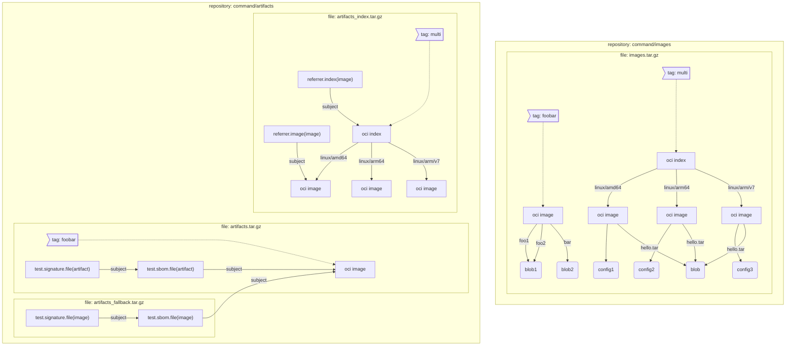
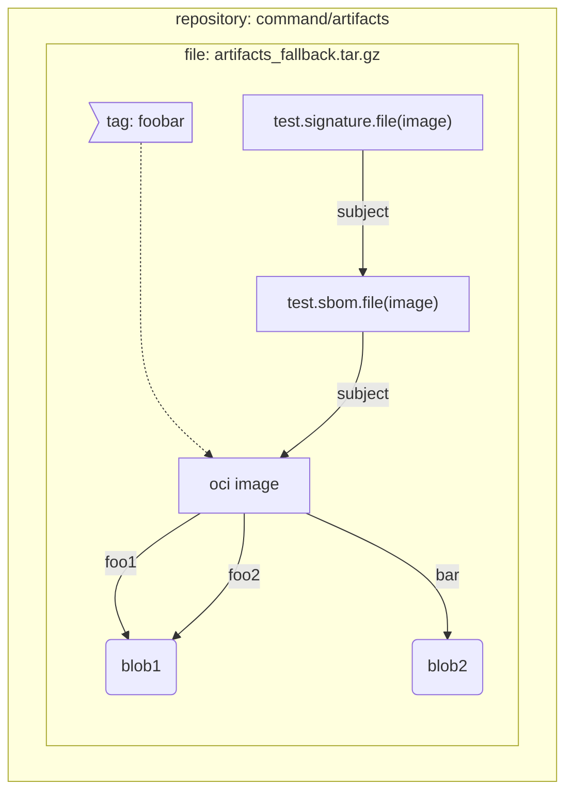

# ORAS End-to-End Testing Dev Guide
**KNOWN LIMITATION**: E2E tests are designed to run in the CI and currently only support running on linux platform.
## Prerequisites
Install [git](https://git-scm.com/download/linux), [docker](https://docs.docker.com/desktop/install/linux-install), [go](https://go.dev/doc/install).

## Run E2E Script
```shell
REPO_ROOT=$(git rev-parse --show-toplevel) # REPO_ROOT is root folder of oras CLI code
$REPO_ROOT/test/e2e/scripts/e2e.sh $REPO_ROOT --clean 
```

If the tests fails with errors like `ginkgo: not found`, use below command to add GOPATH into the PATH variable
```shell
PATH+=:$(go env GOPATH)/bin
```

## Development
### 1. Using IDE
Since E2E test suites are added as an nested module, the module file and checksum file are separated from oras CLI. To develop E2E tests, it's better to set the working directory to `$REPO_ROOT/test/e2e/` or open your IDE at it.

### 2. Testing pre-built ORAS Binary
By default, Gomega builds a temp binary every time before running e2e tests, which makes sure that latest code changes in the working directory are covered. If you are making changes to E2E test code only, set `ORAS_PATH` towards your pre-built ORAS binary to skip building and speed up the test.

### 3. Debugging via `go test`
E2E specs can be ran natively without `ginkgo`:
```shell
# run below command in the target test suite folder
go test oras.land/oras/test/e2e/suite/${suite_name}
```
This is super handy when you want to do step-by-step debugging from command-line or via an IDE. If you need to debug certain specs, use [focused specs](https://onsi.github.io/ginkgo/#focused-specs) but don't check it in.

### 4. Testing Registry Services
The backend of E2E tests are two registry services: [oras-distribution](https://github.com/oras-project/distribution) and [upstream distribution](https://github.com/distribution/distribution). The former is expected to support image and artifact media types and referrer API; The latter is expected to only support image media type with subject and provide referrers via [tag schema](https://github.com/opencontainers/distribution-spec/blob/v1.1.0-rc1/spec.md#referrers-tag-schema), with deletion disabled. 

You can run scenario test suite against your own registry services via setting `ORAS_REGISTRY_HOST` or `ORAS_REGISTRY_FALLBACK_HOST` environmental variables.

### 5. Constant Build & Watch
This is a good choice if you want to debug certain re-runnable specs:
```shell
cd $REPO_ROOT/test/e2e
ginkgo watch -r
```

### 6. Trouble-shooting CLI
The executed commands should be shown in the ginkgo logs after `[It]`, with full execution output in the E2E log.

### 7. Adding New Tests
Three suites will be maintained for E2E testing:
- command: contains test specs for single oras command execution
- auth: contains test specs similar to command specs but specific to auth. It cannot be ran in parallel with command suite specs
- scenario: contains featured scenarios with several oras commands execution

Inside a suite, please follow below model when building the hierarchical collections of specs:
```
Describe: <Role>
  When: Scenario or command specific description
    It: <Action>
      By: <Result> (per-command execution)
       Expect: <Result> (detailed checks for execution results)
```

### 8. Adding New Test Data

#### 8.1 Command Suite
Command suite uses pre-baked test data, which is a bunch of layered archive files compressed from registry storage. Test data are all stored in `$REPO_ROOT/test/e2e/testdata/distribution/` but separated in different sub-folders: oras distribution uses `mount` and upstream distribution uses `mount_fallback`.

For both registries, the repository name should follow the convention of `command/$repo_suffix`. To add a new layer to the test data, use the below command to compress the `docker` folder from the root directory of the registry storage and copy it to the corresponding subfolder in `$REPO_ROOT/test/e2e/testdata/distribution/mount`.
```shell
tar -cvzf ${repo_suffix}.tar.gz --owner=0 --group=0 docker/
```

##### Test Data for ORAS-Distribution


##### Test Data for Upstream Distribution

#### 8.2 Scenario Suite
Test files used by scenario-based specs are placed in `$REPO_ROOT/test/e2e/testdata/files`.