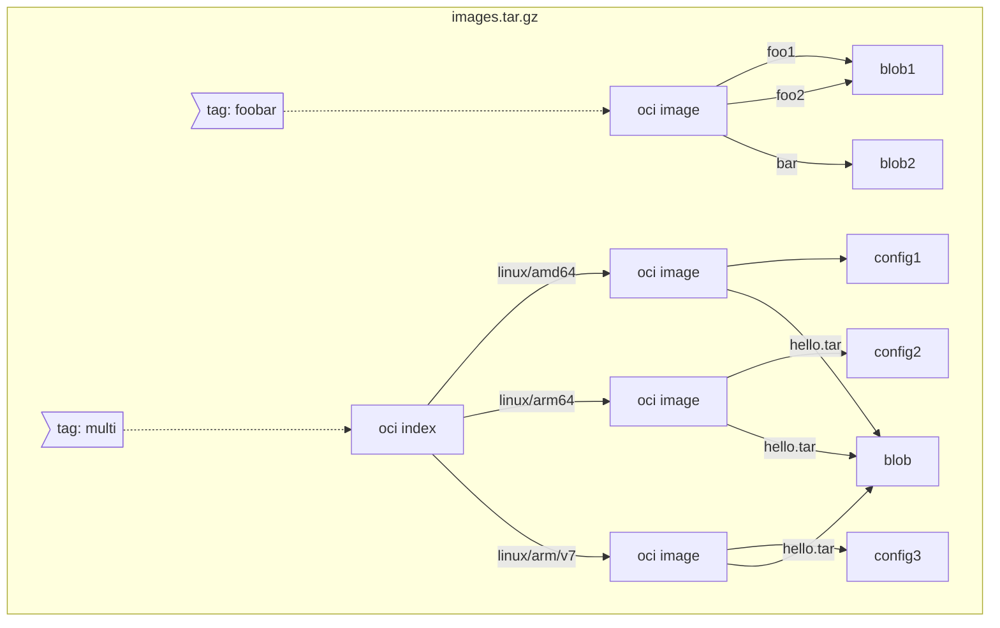

# ORAS End-to-End Testing Dev Guide

## Setting up
Minimal setup: Run the script in **step 3**

### 1. Clone Source Code of ORAS CLI
```shell
git clone https://github.com/oras-project/oras.git
```

### 2. _[Optional]_ Install Ginkgo
This will enable you use `ginkgo` directly in CLI.
```shell
go install github.com/onsi/ginkgo/v2/ginkgo@latest
```
If you skip step 2, you can only run tests via `go test`. 

### 3. Run Distribution
The backend of E2E test is an [oras-distribution](https://github.com/oras-project/distribution).
```shell
PORT=5000
docker run -dp $PORT:5000 --rm --name oras-e2e \
    --env STORAGE_DELETE_ENABLED=true \
    ghcr.io/oras-project/registry:v1.0.0-rc.2
```

### 4. _[Optional]_ Customize Port for Distribution
```shell
export ORAS_REGISTRY_HOST="localhost:$PORT"
# for PowerShell, use $env:ORAS_REGISTRY_HOST = "localhost:$PORT"
```
If you skipped step 4, E2E test will look for distribution ran in `localhost:5000`

### 5. _[Optional]_ Setup ORAS Binary for Testing
```bash
# Set REPO_ROOT as root folder of oras CLI code
cd $REPO_ROOT
make build
```
### 6. _[Optional]_ Setup Pre-Built Binary
You need to setup below environmental variables to debug a pre-built ORAS binary:
```bash
export ORAS_PATH="bin/linux/amd64/oras" # change target platform if needed
export GITHUB_WORKSPACE=$REPO_ROOT
```
If you skipped step 5 or 6, Gomega will build a temp binary, which will include all the CLI code changes in the working directory.

### 7. _[Optional]_ Mount Test Data
If you want to run command suite, you need to decompress the registry storage files and mount to the distribution. `$REPO_ROOT` points to the root folder of cloned oras CLI code.
```shell
mnt_root=${REPO_ROOT}/test/e2e/testdata/distribution/mount
for layer in $(ls ${mnt_root}/*.tar.gz); do
    tar -xvzf $layer -C {mnt_root}$
done

PORT=5000
docker run -dp ${PORT}:5000 --rm --name oras-e2e \
    --env STORAGE_DELETE_ENABLED=true \
    --mount type=bind,source=${mnt_root}/docker,target=/opt/data/registry-root-dir/docker \
    ghcr.io/oras-project/registry:v1.0.0-rc.2
```
Skipping step 7 you will not be able to run specs in Command suite.

## Development
### 1. Constant Build & Watch
This is a good choice if you want to debug certain re-runnable specs
```bash
cd $REPO_ROOT/test/e2e
ginkgo watch -r
```

### 2. Debugging
Since E2E test suites are added to a sub-module, you need to run `go test` from `$REPO_ROOT/test/e2e/`. If you need to debug a certain spec, use [focused spec](https://onsi.github.io/ginkgo/#focused-specs) but don't check it in.

### 3. Trouble-shooting CLI
Executed command should be shown in the ginkgo logs after `[It]`,

### 4. Adding New Tests
Two suites will be maintained for E2E testing:
- command: contains test specs for single oras command execution
- scenario: contains featured scenarios with several oras commands execution

Inside a suite, please follow below model when building the hierarchical collections of specs:
```
Describe: <Role>
  Context: Scenario or command specific description
    When: <Action>
      It: <Result> (per-command execution)
       Expect: <Result> (detailed checks for execution results)
```

### 5. Adding New Test Data

#### 5.1 Command Suite
Command suite uses pre-baked registry data for testing. The repository name should be `command/$repo_suffix`. To add a new layer, compress the `docker` folder from the root directory of your distribution storage and copy it to `$REPO_ROOT/test/e2e/testdata/distribution/mount` folder.
```shell
tar -cvzf $repo_suffix.tar.gz --owner=0 --group=0 docker/
```
Currently we have below OCI images:
