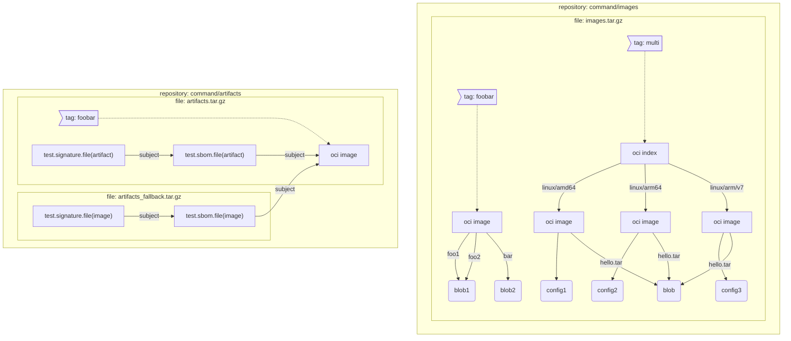
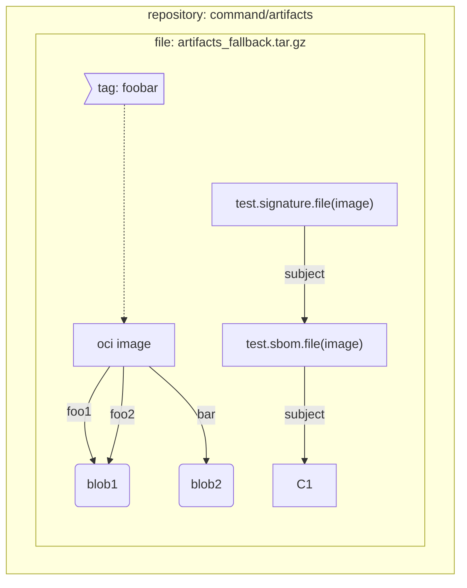

# ORAS End-to-End Testing Dev Guide
**KNOWN LIMITATION**: E2E tests are designed to run in the CI and currently only support running on linux platform.
## Prerequisites
[git](https://git-scm.com/downloads), [docker](https://docs.docker.com/desktop/install/linux-install/), [go](https://golang.google.cn/dl/)

## Run E2E Tests via Ginkgo
### 1. Clone Source Code of ORAS CLI
```shell
git clone https://github.com/oras-project/oras.git
```
### 2. Run E2E Tests
Use below command to prepare and run all test suites.
```bash
$REPO_ROOT/test/e2e/scripts/ci.sh $REPO_ROOT --clean # REPO_ROOT is root folder of oras CLI code
``` 
If you want to preserve the registry data for further troubleshooting, please remove the `--clean` flag.

## Development
### 1. Using IDEs
Since E2E test suites are added as an nested module, it's go module and checksum files are separated from oras CLI and is stored in `$REPO_ROOT/test/e2e/`. To develop E2E tests, it's better to open the workspace from `$REPO_ROOT/test/e2e/`.
### 2. Testing pre-built ORAS Binary
By default, Gomega builds a temp binary every time before running e2e tests, which makes sure that latest code changes in the working directory are covered. To run tests more faster, set `ORAS_PATH` towards an pre-built ORAS binary.
### 3. Debugging using `go test`

E2E specs can be ran natively without `ginkgo`:
```bash
# run below command in the target test suite folder
go test oras.land/oras/test/e2e/suite/${suite_name}
```
This is is super handy for step-by-step debugging when your IDE has a plugin for `go test`  If you need to debug certain specs, use [focused spec](https://onsi.github.io/ginkgo/#focused-specs) but don't check it in.


### 4. Testing Different Distribution Services
The backend of E2E tests are two registry services: [oras-distribution](https://github.com/oras-project/distribution) and [upstream distribution](https://github.com/distribution/distribution). The former supports both image and artifact media types with referrer API; The latter only supports image media type with subject and provides referrers query via [tag schema](https://github.com/opencontainers/distribution-spec/blob/v1.1.0-rc1/spec.md#referrers-tag-schema). 

If you want to test against your own registry services, set `ORAS_REGISTRY_HOST` or `ORAS_REGISTRY_FALLBACK_HOST` environmental variables.

### 5. Constant Build & Watch
This is a good choice if you want to debug certain re-runnable specs
```bash
cd $REPO_ROOT/test/e2e
ginkgo watch -r
```

### 6. Trouble-shooting CLI
The executed commands should be shown in the ginkgo logs after `[It]`, with 

### 7. Adding New Tests
Two suites will be maintained for E2E testing:
- command: contains test specs for single oras command execution
- scenario: contains featured scenarios with several oras commands execution

Inside a suite, please follow below model when building the hierarchical collections of specs:
```
Describe: <Role>
  When: Scenario or command specific description
    It: <Action>
      By: <Result> (per-command execution)
       Expect: <Result> (detailed checks for execution results)
```

### 8. Adding New Test Data

#### 8.1 Command Suite
Command suite uses pre-baked test data, which is a bunch of layered archive files compressed from distribution storage. Test data are all stored in `$REPO_ROOT/test/e2e/testdata/distribution/` but separated in different sub-folders: oras distribution uses `mount` and upstream distribution uses `mount_fallback`.

For both registries, the repository name should follow the convention of `command/$repo_suffix`. To add a new layer to the test data, compress the `docker` folder from the root directory of the distribution storage and copy it to `$REPO_ROOT/test/e2e/testdata/distribution/mount` folder.
```shell
tar -cvzf ${repo_suffix}.tar.gz --owner=0 --group=0 docker/
```


##### Test Data for ORAS-Distribution


##### Test Data for Upstream Distribution

#### 8.2 Scenario Suite
Test files used by scenario-based specs are placed in `$REPO_ROOT/test/e2e/testdata/files`.